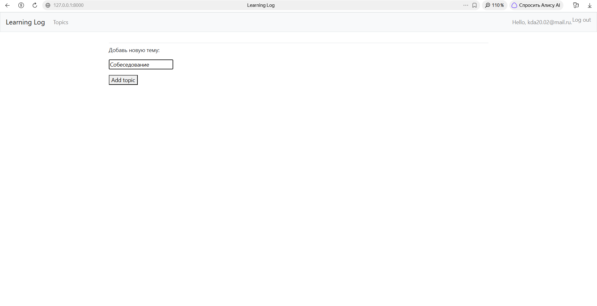
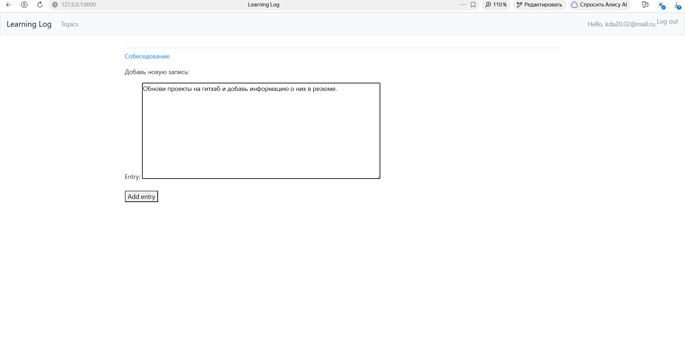
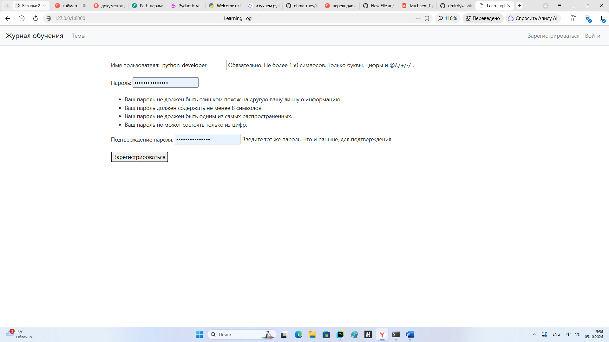
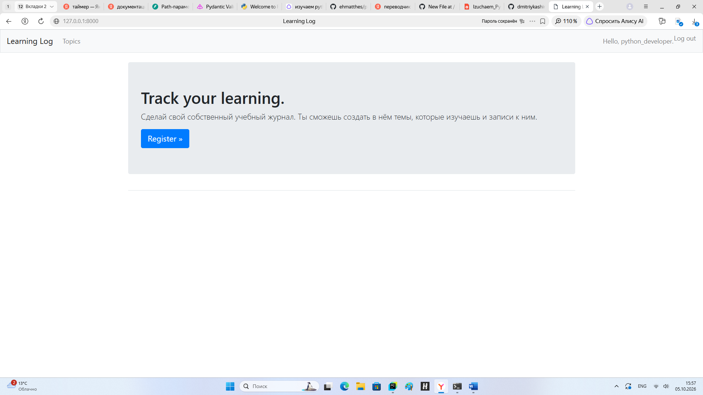
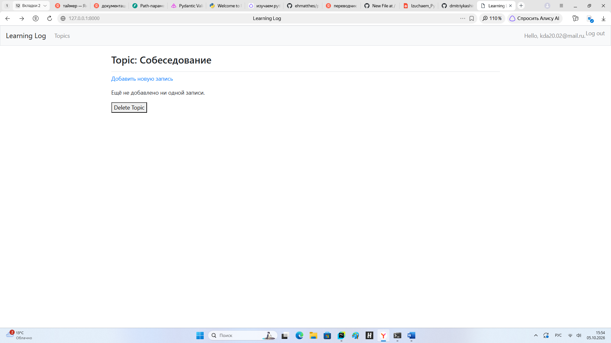

# Learning Logs — учебный Django‑проект

Веб‑приложение для ведения личных логов (темы и записи по ним), реализованное по книге Эрика Мэтиза «Изучаем Python». Проект демонстрирует базовые навыки разработки на Django, работу с базами данных и аутентификацией.

## Что умеет приложение

- Регистрация, вход и выход пользователей.
- Создание тем и добавление записей по каждой теме.
- Просмотр списка тем и записей, редактирование и удаление.
- Админ‑панель для управления пользователями и контентом.

## Скрины некоторых страниц сайта

## Чему научился на этом проекте

- Настройка Django‑проекта и приложений (apps).
- Работа с моделями, формами и представлениями (views).
- Реализация аутентификации и разграничения прав (только владелец видит свои темы/записи).
- Применение миграций и работа с базой данных SQLite.
- Использование шаблонов.
- Настройка URL‑маршрутизации и обработка ошибок.

## Стек технологий

- Python 3.14
- Django 4.x
- SQLite
- HTML
- Git

## Как запустить (для разработчика)

1. Клонируйте репозиторий:  
   `git clone https://github.com/dmitriykashirin/learning-log.git`
2. Создайте и активируйте виртуальное окружение:  
   - Windows: `venv\Scripts\activate`  
   - macOS/Linux: `source venv/bin/activate`
3. Установите зависимости:  
   `pip install -r requirements.txt`
4. Примените миграции:  
   `python manage.py migrate`
5. Создайте суперпользователя:  
   `python manage.py createsuperuser`
6. Запустите сервер:  
   `python manage.py runserver`  

Приложение доступно по адресу `http://127.0.0.1:8000/`.

## Особенности и ограничения

- Проект учебный: используется SQLite, нет сложной обработки ошибок и тестов.
- Разграничение прав реализовано на уровне логики (пользователь видит только свои данные).
- Для продакшена потребуется переход на PostgreSQL, добавление тестов, логирования и деплоя.

## Статус и лицензия

Проект создан в учебных целях. Лицензия не применяется.
